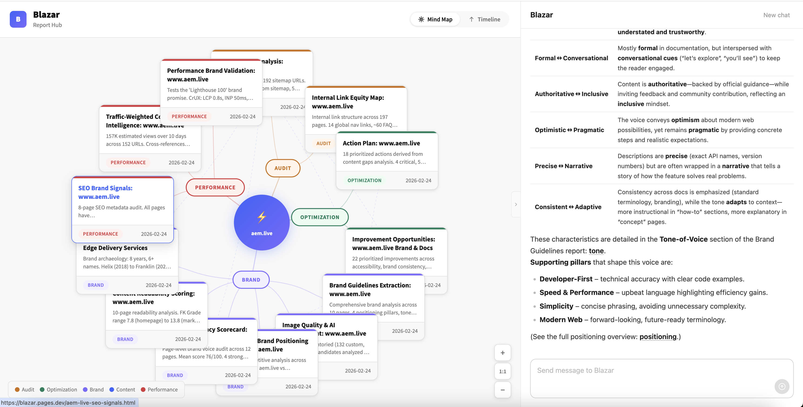
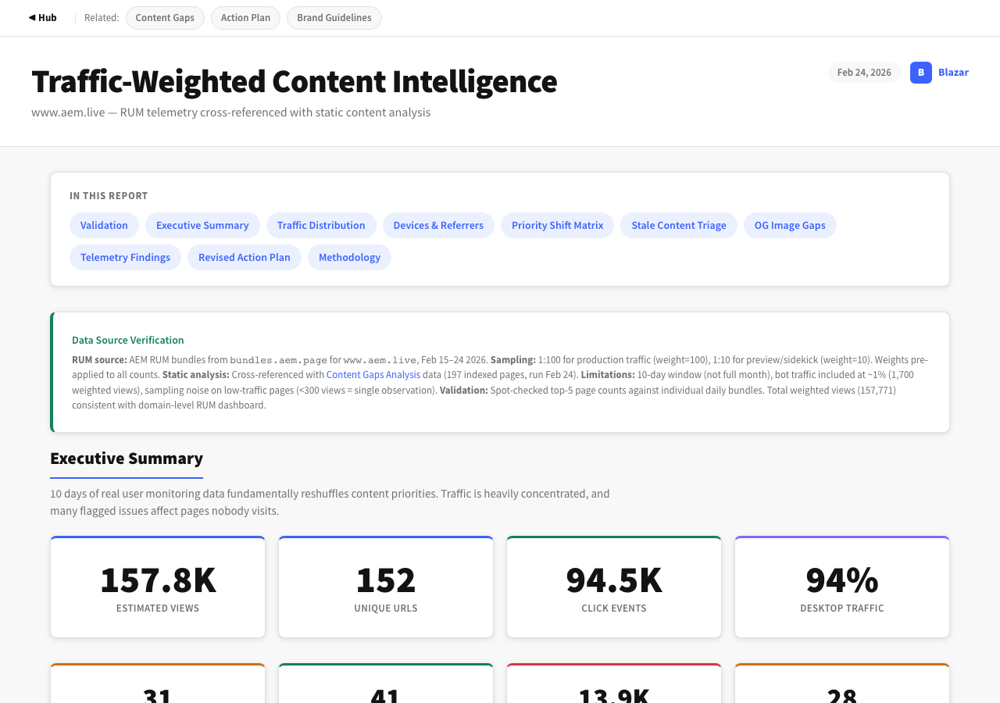
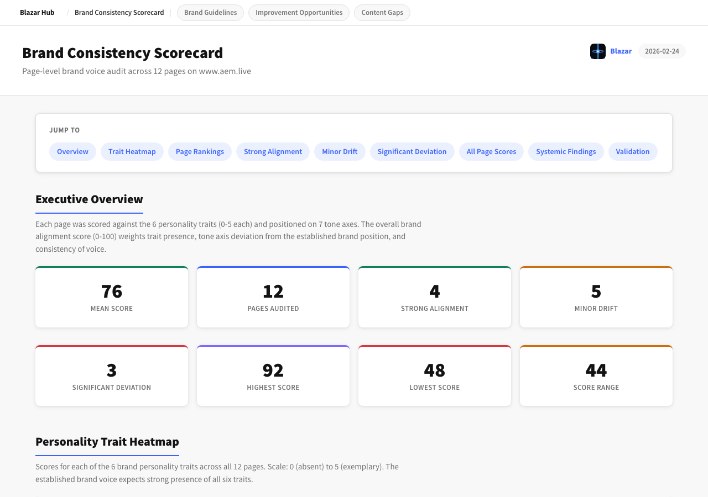

<div align="center">
<br/>


# Blazar

**A CMS that runs itself.**
</div>

Blazar is a content and experience management system that autonomously analyzes, audits, and optimizes digital experiences. Point it at a website and it generates a comprehensive intelligence suite — content gaps, brand consistency, traffic patterns, competitive positioning, performance validation — all as interconnected visual reports that reference and reshape each other.

No dashboards to configure. No manual audits. The system observes, reasons, and produces.

## How it works

Blazar ingests everything a website exposes — sitemaps, query indexes, navigation structures, RUM telemetry, CrUX data, page content, metadata, link graphs — and cross-references it all to surface what matters.

Each analysis becomes a self-contained HTML report. Reports are connected: a content gap finding automatically adjusts priority when traffic data shows nobody visits that page. A brand inconsistency gets escalated when it appears on a high-traffic landing page. The system thinks across its own outputs.

**Phase 1** *(current)*: Read-only analysis and reporting. The system observes and advises.
**Phase 2**: Read/write. The system modifies code and content directly to fix what it finds.

### What it analyzes

- **Content health** — Crawls sitemaps, query indexes, and navigation. Identifies stale pages, broken links, missing metadata, sitemap drift, orphan content.
- **Brand voice** — Extracts brand personality traits and tone guidelines from existing content, then scores every page against them. Tracks brand evolution across product renames and organizational changes.
- **Traffic intelligence** — Processes Real User Monitoring data to weight every finding by actual visitor impact. Reshuffles priorities based on what real people see.
- **SEO & link structure** — Maps internal link equity, identifies dead ends, validates metadata completeness, checks structured data, audits brand visibility in search.
- **Performance claims** — Tests marketing promises ("Lighthouse 100") against real CrUX and RUM data. Separates brand claims from measured reality.
- **Competitive positioning** — Maps the experience against competitors across tone, CTAs, pricing transparency, developer experience, and social proof.
- **Readability & accessibility** — Scores content readability (Flesch-Kincaid), active voice usage, acronym density. Flags content inaccessible to non-technical stakeholders.

### Navigation hub

All reports connect through an interactive hub with mind map and timeline views. Categories (audit, brand, performance, optimization) organize the analysis spatially, while cross-links show how findings relate across domains.

<div align="center">

<br/><sub>The hub mind map: 14 reports organized by category with cross-domain connections</sub>
</div>

### Example: Traffic-weighted content intelligence

RUM telemetry from 157K real user views cross-referenced with static content analysis. The system upgrades and downgrades action priorities based on actual traffic patterns — not assumptions.

<div align="center">

<br/><sub>157K views, 152 URLs, 94% desktop — traffic data reshuffles content priorities</sub>
</div>

### Example: Brand consistency scorecard

Every page scored against 6 brand personality traits and positioned on 7 tone axes. The system identifies which pages drift from the established voice and by how much.

<div align="center">

<br/><sub>Mean score 76/100 across 12 pages — 4 strong alignment, 5 minor drift, 3 significant deviation</sub>
</div>

## Architecture

- **Content-infrastructure agnostic.** Blazar manages any website regardless of its stack. Current test case: AEM Edge Delivery Services. Designed to work with any CMS, framework, or static site.
- **Cloudflare-native.** Blazar's own infrastructure runs on Cloudflare — Pages, Workers, R2, KV, D1. Reports are static HTML with an AI chat assistant powered by Cloudflare Pages Functions.
- **Self-contained reports.** Every report is a single HTML file. No build step, no dependencies, no server. Open in a browser and it works.
- **Cross-validated.** Every report is independently verified — HTTP spot-checks, raw data recounts, content sampling. The system does not grade its own work without external confirmation.

## First managed experience

**[www.aem.live](https://www.aem.live)** — 197 pages analyzed, 14 reports generated:

| Report | Key finding |
|---|---|
| Content Gaps | 72 stale pages (37%), 65 missing OG images, 10 sitemap mismatches |
| Brand Guidelines | 4 positioning pillars, 6 personality traits, 42 evidence quotes extracted |
| Brand Consistency | Mean voice score 76/100 — FAQ page (58) and demo page (48) most off-brand |
| RUM Traffic Intelligence | 157K views over 10 days; 5 actions upgraded, 4 downgraded by traffic data |
| Brand Evolution | 8 years, 6+ product names, 40+ repos still using deprecated branding |
| Performance Validation | LCP 0.8s, INP 50ms, CLS 0.00 — "Lighthouse 100" claim validated with caveats |
| Competitor Positioning | Mapped against Contentful, Sanity, Netlify, Vercel, WordPress VIP |
| + 7 more | SEO signals, link equity, readability, image quality, developer touchpoints... |

## Quick start

```bash
# Reports are self-contained HTML — just open the hub
open reports/hub.html
```

Every report includes navigation back to the hub and links to related reports. An AI chat assistant is embedded in each report for follow-up questions.

## Project structure

```
reports/           Visual HTML reports + hub
  hub.html         Mind map & timeline navigation
  chat.js          AI chat widget (Cerebras-powered)
scripts/           Data collection & analysis scripts
data/              Raw analysis JSON
journal/           Conversation-indexed project log
functions/         Cloudflare Pages Functions
```

---

<div align="center">
<sub>Named after the most luminous objects in the universe — active galactic nuclei<br/>with relativistic jets pointed directly at the observer.</sub>
</div>
