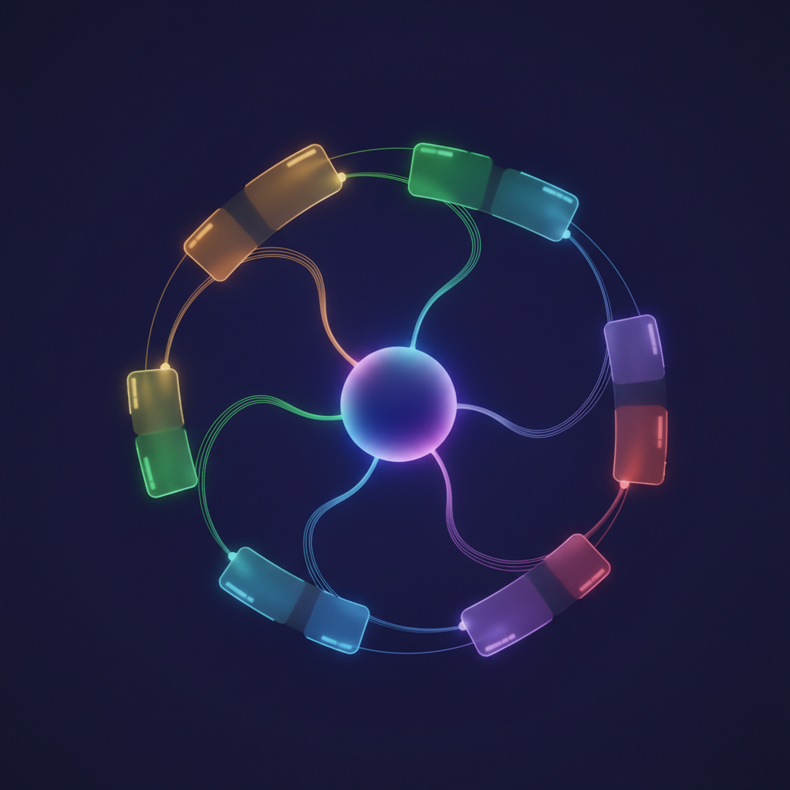

<div align="center">


# Blazar

**The LLM *is* the CMS.**

Blazar replaces the SaaS admin panel with an AI that analyzes, reports on,
and eventually writes your digital experiences.

</div>

---

## What it does

Blazar manages websites the way a senior consultant would — except it never sleeps and processes 200 pages in minutes, not weeks.

| Capability | How |
|---|---|
| **Content audit** | Crawls sitemaps, query indexes, and navigation. Finds gaps, stale pages, broken links, missing metadata. |
| **Brand intelligence** | Extracts voice guidelines, scores consistency page-by-page, tracks brand evolution over time. |
| **Performance validation** | Cross-references RUM telemetry with CrUX data. Validates marketing claims against real metrics. |
| **Competitive positioning** | Maps your brand against competitors across tone, CTAs, pricing transparency, social proof. |
| **Visual reports** | Every finding becomes a self-contained HTML report — no build step, no server. |

<div align="center">


*Reports connect in an interactive mind map with timeline and category views.*
</div>

## Architecture

<div align="center">

</div>

- **Content-infrastructure agnostic.** Manages any website regardless of its stack — AEM Edge Delivery Services, Cloudflare Pages, WordPress, anything with a URL.
- **Cloudflare-native infrastructure.** Pages, Workers, R2, KV, D1 — the full stack.
- **Phase 1** *(current)*: Read-only analysis and visual reporting.
- **Phase 2**: Read/write — the LLM modifies code and content directly.

## First managed experience

**[www.aem.live](https://www.aem.live)** — 197 pages, 14 reports generated in a single day:

- Content gaps across 197 indexed pages and 192 sitemap URLs
- Brand consistency scorecard (mean 76/100 across 12 pages)
- Traffic-weighted priorities from 157K real user views
- Brand evolution archaeology spanning 8 years and 6+ product names
- Performance validation of the "Lighthouse 100" marketing promise
- Competitive positioning against Contentful, Sanity, Netlify, Vercel, WordPress VIP

All reports are interconnected — findings in one automatically reshape priorities in others.

## Quick start

```bash
# Reports are self-contained HTML — just open them
open reports/hub.html
```

The hub offers both a **mind map** (spatial navigation by category) and a **timeline** (chronological view). Every report includes an AI chat assistant for follow-up questions.

## Project structure

```
reports/          # Visual HTML reports + hub
  hub.html        # Mind map & timeline navigation
  chat.js         # AI chat widget (Cerebras-powered)
scripts/          # Data collection & analysis
data/             # Raw analysis JSON
journal/          # Conversation-indexed project log
functions/        # Cloudflare Pages Functions
```

---

<div align="center">
<sub>Named after the most luminous objects in the universe — active galactic nuclei with relativistic jets pointed directly at the observer.</sub>
</div>
